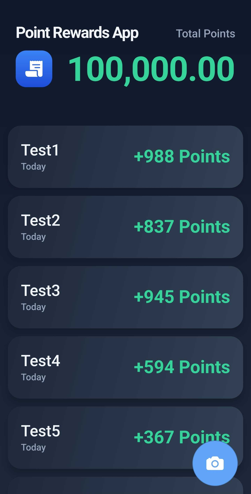

# Receipt Scanner App 🧾

## Overview
A small Expo + React Native side project built to learn mobile UI, theming, and native plugin integration. The app demonstrates a simple "points from receipts" concept with a mock scan history, a native document scanner integration, theming, and a few reusable UI components.

---

## Quick demo / Screenshots

Add your screenshots to `assets/images/` and replace the placeholders below.

*Home: scan history and header showing total points.*

*Scanner flow placeholder — opens native scanner plugin.*

*Scan history item row and floating actions.*

---

## Features

- Expo + React Native (TypeScript)
- Theme support (light/dark) with persisted preference
- Native document scanner integration using `react-native-document-scanner-plugin`
- Mock scan history (FlatList) with a floating "scan" button and a scroll-to-top action
- Small, focused components and style factories for theme-aware styling

---

## What I implemented — learning narrative

This project was intentionally small and focused so I could learn practical aspects of mobile development:

- Theming & persistence
  - Implemented a ThemeProvider and hook to expose colors and toggle state. Persisted the preference to storage to learn about async initialization, side effects, and context usage.
- Native plugin integration
  - Integrated `react-native-document-scanner-plugin` and implemented Android camera permission flow (PermissionsAndroid). This taught me platform differences and how to handle native module responses and errors.
- Component-driven design
  - Built reusable components (Header, ScanHistoryItem, AddScanItemButton, ScrollToTopButton) and style factories (home/styles) so UI is consistent and theme-aware.
- UX & small interactions
  - Implemented FlatList performance considerations, refs for scroll control, and conditional floating actions to practice real UX patterns.

---

## Key files

- app/index.tsx — Main screen and scanner integration
- app/_layout.tsx — App wrapper (theme provider / router)
- hooks/useTheme.tsx — Theme context, provider, hook, persistence
- components/* — UI components: Header, AddScanItemButton, ScanHistoryItem, ScrollToTopButton
- assets/styles/* — Style factory functions for screens

---

## Run locally

1. Install dependencies
   npm install

2. Start Expo
   npx expo start

3. Run on device/emulator
   npm run android
   npm run ios

(Requires Expo CLI and a configured environment for Android/iOS.)

---

## App Store / Play Store copy suggestions

Short (for store listing header)
- "Scan receipts. Earn points. Track history."

Promotional / one-line
- "Quickly scan receipts and track reward points — simple, local, and theme-aware."

Long description (for App Store / Play Store)
- "Receipt Points is a lightweight receipt-scanning demo app built with Expo and React Native. Scan receipts using a native document scanner, view a searchable history, and track points assigned to each receipt. This app demonstrates a learn-by-building approach: theming with persisted preferences, native plugin integration, permissions handling, and small, reusable UI components. Ideal as a reference or starting point for receipt/expense features."

Suggested keywords / tags
- receipts, scanner, rewards, points, expense, scan, mobile, React Native, Expo

Suggested screenshot captions
- "Scan receipts using the device camera"
- "View your scanned receipt history"
- "Tap to add a new scan — points assigned instantly"
- "Light and Dark themes supported"

---

## Next steps / TODO

- Persist scan history (AsyncStorage / backend)
- Add OCR / receipt parsing and real points logic
- Improve error flows and permission UX
- Add unit and integration tests

---

## License

This project is a personal learning project. Use the code as a reference.
